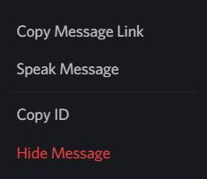
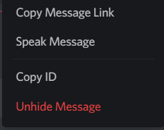

# HideMessage

Right-click on any message and click the `Hide Message` option to hide it, which makes it show up as a blocked message.

To unhide, right-click again and click the `Unhide Message` option.

